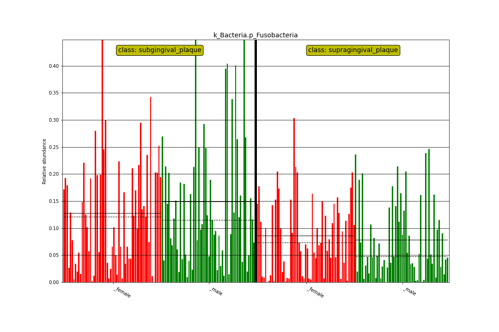
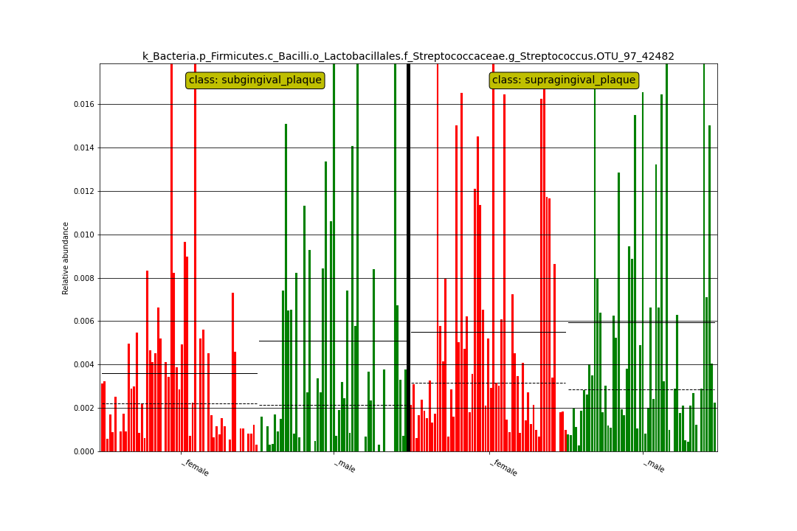

```{r, include = FALSE}
knitr::opts_chunk$set(
  collapse = TRUE,
  comment = "#>"
)
```

```{r setup, message=FALSE}
library(MicrobiomeBenchmarkDataLefse)
library(purrr)
library(dplyr)
library(readr)
library(dplyr)
library(tidyr)
library(stringr)
```

## Import lefse-conda results

```{r}
colNames <- c("feature", "log", "class", "lda", "pval")
dirName <- system.file("extdata", package = "MicrobiomeBenchmarkDataLefse")
fNames <- list.files(dirName, full.names = TRUE, pattern = ".res")
dats <- fNames |> 
    map(~ read_tsv(.x, show_col_types = FALSE, col_names = colNames))
names(dats) <- fNames |> 
    str_extract("_a.+_w.+_lda\\d_it\\d+_bp\\d+") |> 
    str_remove("^_")
```

All datasets contain the same number of rows, representing all taxa in the
dataset:

```{r}
unique(map_int(dats, nrow))
```

Divide the results in two lists:
1. lda3 = anova = 0.01, wilcox = 0.01, lda = 3.
2. lda2 = anova = 0.05, wilcox = 0.05, lda = 2.

```{r}
lda3 <- dats[grep("lda3", names(dats))]
lda2 <- dats[grep("lda2", names(dats))]
```

## Number of features passing all the thresholds

Let's check the number of significant features passing all the
thresholds. Compare these numbers with the logs in the inst/extdata directory.
Link: https://github.com/waldronlab/MicrobiomeBenchmarkDataLefse/tree/main/inst/extdata

For lda3:

```{r}
lda3 |> map_int(~ nrow(drop_na(.x)))
```

For lda2:

```{r}
lda2 |> map_int(~ nrow(drop_na(.x)))
```

## Number of features in lda3 passing the pvalue threshold

Number of features with P-value data:

```{r}
lda3 |> map_int(~ {
    .x |> 
        filter(!is.na(pval)) |> 
        filter(!grepl("-", pval)) |> 
        nrow()
})
```

P-value < 0.01

```{r}
lda3 |> map(~ {
    .x |> 
        filter(!is.na(pval)) |> 
        filter(!grepl("-", pval)) |> 
        mutate(pval = as.double(pval)) |> 
        mutate(pass = ifelse(pval < 0.01, "yes", "no")) |> 
        count(pass)
}) |> 
    bind_rows(.id = "res")
```

## Number of features in lda2 passing the pvalue threshold

```{r}
lda2 |> map_int(~ {
    .x |> 
        filter(!is.na(pval)) |> 
        filter(!grepl("-", pval)) |> 
        nrow()
})
```

P-value < 0.01

```{r}
lda2 |> map(~ {
    .x |> 
        filter(!is.na(pval)) |> 
        filter(!grepl("-", pval)) |> 
        mutate(pval = as.double(pval)) |> 
        mutate(pass = ifelse(pval < 0.05, "yes", "no")) |> 
        count(pass)
}) |> 
    bind_rows(.id = "res")
```


# Plot examples

## Cladogram


## Histogram (clade)



## Histogram (OTU)



```{r}
sessioninfo::session_info()
```
